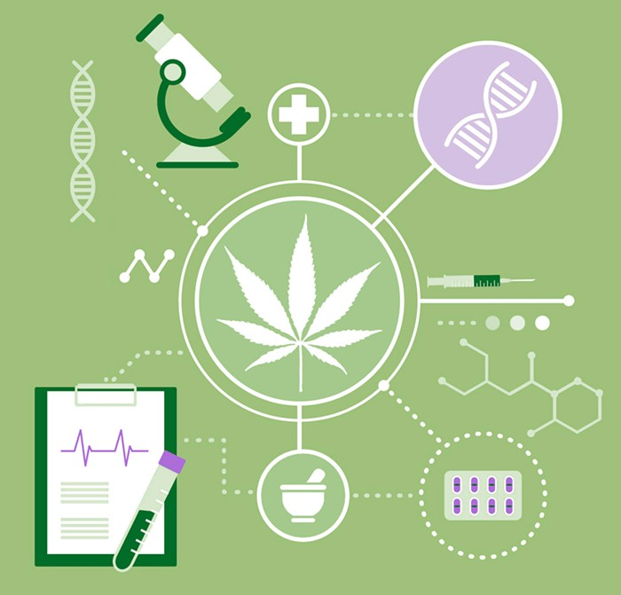

## Group 1: Bowie Hand, Darya Rudych, Jessica Serna, Lu Wang, Shweta Banerjee, Yedidya Erque

# Project Title: Impacts of Marijuana Legalization

## Objective:
Recreational marijuana is always a hotly debated subject. Through this project, we wanted to understand the Impact of legalizing recreational Marijuana on the States. We will be doing an exploration of various factors like GDP, Population, Employment etc. and to draw out a comparison between pre-legalization vs post-legalization years. Through our project, we aim to study and understand several facts and figures to find the answer for ourselves, is the criticism of recreational marijuana fair?

## Dataset:
The dataset we will be using contains information about the states that have legalized marijuana and the key factors that affect the same and spans from 2007 to 2017. Specifically, the dataset includes information on:
1. **Population**
2. **Employment**

3. **Unemployment Rates**
4. **Gross Domestic Product (GDP)**
5. **Tax Revenue**

## Statistical Testing:
1. Since population and GDP have a natural trend of increasing over years, we need to conduct statistical analysis to determine whether legalization of weed has affected that trend.
2. Since we assume the homogeneity of variance in our pre- and post-legalization population samples, we can perform a z-test.
3. Our null-hypothesis assumes that the true mean difference between the paired samples is zero which means any difference between pre- and post metrics is due to random variation.
4. Our alternative hypothesis assumes that the true mean difference between the paired samples is not equal to zero and it might be due to herb legalization.

## Future Scope:
1. To dive further into other key elements such as Crime Rates and Vehicle Accident Rates and explore how these are also affected by the legalization of Marijuana.
2.  Study the costs associated with Marijuana legalization such as Drug Testing, Litigation, Cops, License etc. To weigh all the pros and cons to decide whether it's profitable or not.

## Sources:
1. [U.S. Bureau of Economic Analysis (BEA)](https://www.bea.gov/)
2. [Uniform Crime Reporting (UCR) Program — FBI](https://www.fbi.gov/services/cjis/ucr)
3. [United States Census Bureau](https://www.census.gov/en.html)
4. [Annual Survey of State Government Tax Collections (STC)](https://www.census.gov/programs-surveys/stc/data/datasets.html)
